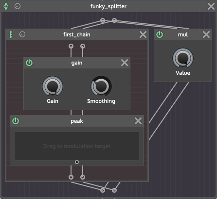
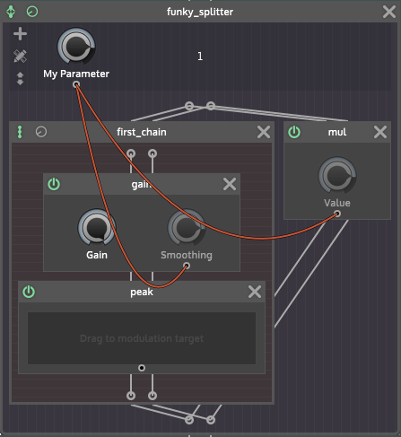

The Cpp generator will take your scriptnode graph and turn it into Cpp code that will utilize the full optimizing power of modern compilers. There are two ways to use it:

- create meta nodes for further usage
- compile project specific graphs into a Cpp module.

The idea of scriptnode is that you can start with the most low-level nodes (math operations, filters, basic DSP building blocks), and build up complex DSP algorithms. The outcome of this process can be turned into a reusable C++ module itself, which helps build up a library of nodes.

The `meta` nodes that are built into HISE have been created this way, and you can always "unfreeze" them and take a peek under the hood to understand how it works.

## Create meta nodes

If you have setup your system for developing in HISE, you will have a compiler and the latest source code of HISE available. Unlike before where the compiler was just a annoying thing you have to install in order to use HISE, we can now finally leverage its power and make it a helpful tool in our development workflow.

If you have spent some time with scriptnode, you might have realized that certain graphs have an ridiculously high CPU usage. This is especially true for graphs that utilize single-sample processing since it will cause the graph to be calculated for each sample. Combine this with 16x oversampling, and the most simple graph will burn even modern CPUs. While this is a no-go for any other development platforms, we can lean back and trust the compiler to produce a reasonably fast product at the end.

However, if you're hitting CPU levels which are too high even for development (or if you have finished the work on a certain sub-graph and want to check how it will perform in the end), you can always take that scriptnode graph, export it as Cpp, recompile HISE and then use the Cpp version (you can even jump back to the interpreted version with a single click to make adjustments and recompile the graph for an iterative workflow style).  
However, HISE in it's default state has this feature disabled (otherwise you would not be able to compile it). There are two things that you have to do:

### Setup the folder

Point HISE to the folder where you want your custom nodes to be stored in. This can (and should) be a folder outside of the HISE repository, so it doesn't conflict with Git. By doing so, you will create a redirection file in the HISE repository (so before enabling this, you have to set the HISE path correctly).


### Recompile HISE

Open the projucer file of HISE (either the standalone or the plugin project), change the compile flag `HI_ENABLE_CUSTOM_NODE_LOCATION` in the `hi_modules` module and recompile HISE:


### Export nodes

If you have set this up correctly, you can just right click on any container in your graph and select **Export graph as Cpp module**. It will create the Cpp code, copy it to the location you have specified **and replace the existing node with it's hardcoded version**. You can now save your current state, recompile HISE and load up your previously saved project and it will automatically use the hardcoded version.

## Compile project exclusive graphs

This feature is currently only useful in conjunction with raw-usage, but it will be expanded to regular use-cases later. 

If you export a plugin that uses a scriptnode module, it will automatically create a Cpp version and use this instead of the interpreted one.

## How it works

If you don't care about the code it generates or don't know Cpp, feel free to skip this chapter. However if you're interested in the internals of the code generator (whether you want to troubleshoot a bug, modify the code or just want to steal the idea for your own framework), keep reading for a brief explanation of the code being generated. Anyway you will get a deeper understanding about scriptnode and some of its design principles.

### Organisation

Each node that you export will create a file with a single class with its ID in the namespace you target (so either `custom` for nodes exported into your custom directory or `project` for nodes in your project directory).

They are all subclassed from `scriptnode::hardcoded<T>`, which tries to tuck away most of the boilerplate, so that the exported code looks like a declarative description of your signal graph with the minimal amount of boilerplate.

```cpp
// Example.cpp

namespace custom
{

 namespace Example_impl
 {

  using T = //... some metatemplate definition

  class instance: public hardcoded<T>
  {
   // ... stuff
  };
 }

 REGISTER_MONO // tucks away the factory registration method
 }

using Example = Example_impl::instance;
}

```

As you can see, it moves the implementation into a private namespace called `Class_impl`, and then uses a alias to refer to the implementation in the `custom` namespace (so it's accessible as `custom::Example` from other nodes).

Now this looks pretty boring, but it's important to understand the structure. Everything else will either be declared as compile-time expression (the signal path) or in the constructor (the default initialisation values and parameter callbacks).

### Graph Representation

As you may know by now, scriptnode is using different container types to build up a complex signal path. Each container is a simple list, but the way how it processes its children depends on the type: `container.chain` containers will process one node after another serially, `container.multi` splits up the incoming channels to its children and a `container.frame2_block` will iterate over the buffer and process each frame.

The code generator uses the same principle and combines it with meta-template programming to reproduce the graph using variadic templates for each container type. To be honest, I stole the template implementation from the `juce::dsp` module and extended it with different types, so at least half of the credits go to the JUCE team :)

#### Example




The screenshot shows a pretty useless scripnode graph: it splits the signal and processes one copy with a chain of a `core.gain` node followed by a `core.peak` node. The other copy will be just multiplied by `1.0`. The syntax of the container templates is standard Cpp template syntax:

```cpp
container::type<node1, node2, ...>;
```

However for the sake of readability, the generator uses aliases for each container to avoid spaghetti template definitions. In this case it will create these lines:

```cpp
using first_chain = container::chain<core::gain, core::peak>;
using funky_splitter = container::split<first_chain, math::mul>;
```

You might notice a few things:

- the node factories (`core`, `math`, `container`) are represented as namespaces - and every node you generate will end up in either the `custom` or the `project` namespace, depending on your export target.
- template aliases will use the ID of the chains in the graph, so a well-organised scriptnode graph will create a well organised code.

#### Initial values

The selection and organisation of nodes is just one half of the algorithm - finding good initial values and adding parameters / modulation with meaningful ranges is almost as important. 

If you export a graph, it will initialise each node's parameter with the value at **the time of the export** - so if you recompile it and exchange it with it's Cpp version, it will sound the same.

In order to do so, the code generator has to "register" each node and give it an ID. The reference to the node has to be a compile-time expression, so we are using a templated method that requires the "path" to the node. As soon as a node is registered, we can assign default values, add parameter modulation and so on.

```cpp
registerNode(get<0, 0>(obj), "gain");
```

In our example, the gain module is the first element of the first child of the main container, hence its path `<0, 0>`. (the peak node has the path `<0, 1>` and the mul node `<1>`). The ID can be anything, so we just use the original ID of the node, which I was to lazy to rename from its default name.

The default value initialisation is now as straightforward as it can be:

```cpp
setParameterDefault("gain.Smoothing", 200.0);
```

#### Parameters



Any parameter that you add to the container you export will be made publicly available as node parameter after the export. In our little example graph we'll add a parameter and connect it to the smoothing of the gain and the value of the multiplication (again, totally useless, but some people said the effect makes certain vocals sound warmer)

Now every parameter in scriptnode is a lambda / function with this prototype:

```
std::function<void(double)>
```

> The reason why I chose double precision is that this is required for a few applications (eg. filter coefficients or oscillator delta values), so in order to stay consistent and keep the code simple we have to live with the tiny overhead of double precision parameter changes and its conversion to the standard floating point signal type.

This makes the definition of parameters pretty straightforward: we just grab a copy of the lambda, convert the values into the given target range and then call each lambda in the lambda we create.

First of all we create the parameter data for our parameter:

```cpp
ParameterData p("My Parameter", { 0.0, 1.0, 0.01, 1.0 });
```

The thing in the brackets is the range definition with the order `{min, max, interval, skew}`.

Now we grab the lambda for the targets:


```cpp
auto param_target1 = getParameter("gain.Smoothing", { 10.0, 300.0, 1.0, 1.0 });
auto param_target2 = getParameter("mul.Value", { 0.0, 1.0, 0.01, 1.0 });
```

Now we can give these two lambdas to the callback of the parameter `p` (`db` stands for `double callback` which is unfortunately poor naming).

```cpp
p.db = [param_target1, param_target2, outer = p.range](double newValue)
{
	auto normalised = outer.convertTo0to1(newValue);
	param_target1(normalised);
    param_target2(normalised);
};
```

Now we just need to add the parameter to the internal data object to register it as externally accessible parameter:

```cpp
data.add(std::move(p));
```

That's it - there are a few extra cases like controlling the bypass state or modulating parameters, but this should get you enough information to understand the rest of the system.

#### Final Code

Until now, I was just cherry-picking the most interesting code lines, but here you can take a look at the generated code as it was created by scriptnode. I'd like to point your attention to these details:

- the big fat string contains the entire signal path as Base64 encoded snippet - this allows the "unfreezing" of the node if you want to modify it later on.
- there's absolutely no code being generated that is executed after the initialisation - the framework just wants a declaration and takes care of anything else.
- the `REGISTER_MONO` macro is registering a monophonic version of the graph. If the graph was created in a polyphonic context, it will also create a polyphonic version called `custom::funky_splitter_poly`.

```cpp
namespace funky_splitter_impl
{
// Template Alias Definition =======================================================
using first_chain_ = container::chain<core::gain, core::peak>;
using funky_splitter_ = container::split<first_chain_, math::mul>;

struct instance: public hardcoded<funky_splitter_>
{
    SET_HISE_NODE_ID ("funky_splitter");
    GET_SELF_AS_OBJECT (instance);
    SET_HISE_NODE_IS_MODULATION_SOURCE (false);
    
    String getSnippetText() const override
    {
        return "628.3ocyUtriSCCEF93xXfNkqBPyJP7.LpqXMsZ5nYTkZKkoc.wBzHShmVqFGG43PIkErAVyZPBwa.hkvBj3EfU7DvRDrf2.vNg1layPkFUQyhjF6y43uee9iaGgMEPkatMftD9v.2QgG364vTJpD1gXoDxvtD0P.cYrkvUQXtTY0nHfNA7FCIttTGe.gQk..ZIrFkZXzo5nWfFBGQfzDjNFngfyotJ.UBO822mYaVCLZScD8FJF2kHIbpFBSMJsijRmPsiAYCrUfuRvqlg13kxGz0sSjnNqQTmGeHS5qNvZnF8iVQwSurTzVgdDe+8Hbu9LNsstJkWChttU8hw9z3A43shlWIs5f+ej1VXG3PTLgaehb.UooF5JEdTohEKg+9VntaXjw4v6Q8op6QbBnP78YETmZvibXVFPgL4cQ799zEM04VEC.SeyXpcertlTaSXsYtYJxC9baxSxU3VhwTYKFW6uSD49dd4FUaTUTudrIQ4+5WYt9Xsdinii6ZlQus0m9xf2es5wszcMctbqHj.4JGOx.jC45urdQHCPAHqi8ei7uCea2qr8WqYPtBtGWHTCYtCly8aJswlOr7yp2Pn8YVFy.ftdliNp1N7lyk0c75G5oyccbuoMTHkW2iRFUnWOZhUHudBqVJi+wLSBghw7.mz5bcLW+rpY7USYhPmH6I7qZKr8TGaR64Su5618aSddF64zHM6mmAm4zged2ObiW7iuW6jYMOxFap8h0LDbAbppsnaI4.FglibzwXIUPESOuo8r+TX15YFK4mn5jhZORidZZqMBL8IpEHwUmSYfBEZ7GJoz4zd8xSiKMqZZC0e.o0HhlA";
    }
    
    void createParameters(Array<ParameterData>& data)
    {
        // Node Registration ===============================================================
        registerNode(get<0, 0>(obj), "gain");
        registerNode(get<0, 1>(obj), "peak");
        registerNode(get<1>(obj), "mul");
        
        // Parameter Initalisation =========================================================
        setParameterDefault("gain.Gain", 0.0);
        setParameterDefault("gain.Smoothing", 496.585);
        setParameterDefault("mul.Value", 0.81);
        
        // Setting node properties =========================================================
        setNodeProperty("gain.ResetValue", 0, false);
        setNodeProperty("gain.UseResetValue", 0, false);
        
        // Parameter Callbacks =============================================================
        {
            ParameterData p("My Parameter", { 0.0, 1.0, 0.01, 1.0 });
            
            auto param_target1 = getParameter("gain.Smoothing", { 0.0, 1000.0, 0.1, 0.30103 });
            auto param_target2 = getParameter("mul.Value", { 0.0, 1.0, 0.01, 1.0 });
            
            p.db =  [param_target1, param_target2, outer = p.range](double newValue)
            {
                auto normalised = outer.convertTo0to1(newValue);
                param_target1(normalised);
                param_target2(normalised);
            };
            
            
            data.add(std::move(p));
        }
    }
    
};

REGISTER_MONO;
}

using funky_splitter = funky_splitter_impl::instance;
```
